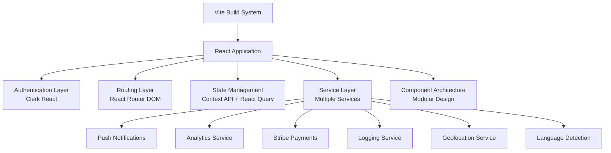

# LegacyGuard Application - Comprehensive Architectural Analysis

## Executive Summary

This document presents a comprehensive architectural analysis of the LegacyGuard Vite/React application. The analysis reveals a well-structured codebase with modern React patterns, comprehensive service layer architecture, and robust error handling. Key findings include both architectural strengths and opportunities for improvement.

## Current Architecture Overview

### Technology Stack
- **Build System**: Vite with React SWC plugin, TypeScript
- **Authentication**: Clerk React integration
- **Routing**: React Router DOM with lazy loading
- **State Management**: React Context API + React Query
- **Styling**: Tailwind CSS with theme system
- **Testing**: Jest + React Testing Library (recommended)
- **Deployment**: Vercel-ready configuration

### Architecture Diagram


## Strengths Identified

### 1. Modern Build Configuration
- Advanced Vite setup with manual chunk optimization
- TypeScript integration with comprehensive type safety
- Progressive Web App capabilities
- Performance monitoring with Web Vitals

### 2. Comprehensive Service Layer
- Well-structured service classes for different domains
- Clean separation of concerns
- Extensive error handling and logging
- Consistent API patterns across services

### 3. Robust Error Management
- Centralized error context with persistence
- User-friendly error notifications via toast system
- Comprehensive logging service with Supabase integration
- Error boundary implementation

### 4. Performance Monitoring
- Custom performance hooks for Web Vitals
- Real-time performance tracking
- Analytics integration with PostHog
- Bundle size optimization

## Critical Architectural Issues & Recommendations

### High Priority (Immediate Implementation)

#### 1. API Client Standardization
**Issue**: Inconsistent API client patterns across services
**Solution**: Create centralized API client factory

```typescript
// src/lib/api/clientFactory.ts
export class APIClientFactory {
  static createClient(baseURL: string, options?: ClientOptions) {
    return axios.create({
      baseURL,
      timeout: options?.timeout || 10000,
      headers: {
        'Content-Type': 'application/json',
        ...options?.headers,
      },
    });
  }
}
```

#### 2. State Management Optimization
**Issue**: Context API overload with multiple providers
**Solution**: Consolidate contexts and consider state management library

#### 3. Performance Budgets
**Solution**: Implement bundle size monitoring
```json
// package.json
{
  "bundlesize": [
    {
      "path": "./dist/assets/*.js",
      "maxSize": "150 kB"
    }
  ]
}
```

### Medium Priority (Next Sprint)

#### 1. Testing Infrastructure
- **Unit Tests**: Service layer testing
- **Integration Tests**: API interaction testing
- **Component Tests**: React Testing Library
- **E2E Tests**: Playwright/Cypress

#### 2. Monitoring & Analytics
- Error tracking with Sentry
- Performance monitoring dashboard
- User analytics pipeline

### Low Priority (Future Enhancement)

#### 1. Micro-frontend Architecture
- Module federation evaluation
- Shared component library
- Independent deployment strategy

#### 2. Advanced Performance Features
- Service worker caching strategies
- Progressive enhancement
- Low-end device optimization

## Implementation Roadmap

### Phase 1: Immediate (Week 1)
- [ ] Create API client factory
- [ ] Add error boundaries
- [ ] Set up performance budgets

### Phase 2: Short-term (Weeks 2-3)
- [ ] Refactor state management
- [ ] Implement testing infrastructure
- [ ] Add monitoring and analytics

### Phase 3: Long-term (Month 2)
- [ ] Evaluate micro-frontend architecture
- [ ] Implement advanced performance features
- [ ] Create shared component library

## Code Quality Recommendations

### 1. Service Layer Refactor
```typescript
// Base service class to reduce duplication
abstract class BaseService {
  protected readonly baseURL: string;
  protected readonly logger: LoggingService;
  
  constructor(baseURL: string) {
    this.baseURL = baseURL;
    this.logger = new LoggingService();
  }
  
  protected handleError(error: Error, context: string): void {
    this.logger.logError(error, context);
  }
}
```

### 2. Error Handling Strategy
```typescript
// Centralized error handling
class ErrorBoundary extends React.Component<Props, State> {
  static getDerivedStateFromError(error: Error): State {
    return { hasError: true, error };
  }
  
  componentDidCatch(error: Error, errorInfo: ErrorInfo) {
    console.error('Error caught by boundary:', error, errorInfo);
  }
}
```

### 3. Performance Optimization
- Implement route-based code splitting
- Add component-level lazy loading
- Optimize bundle size analysis

## Security Considerations

- **Authentication**: Clerk React provides secure authentication
- **API Security**: Implement proper CORS and rate limiting
- **Data Protection**: Ensure GDPR compliance with user data
- **Error Handling**: Avoid exposing sensitive information in errors

## Testing Strategy

### Recommended Testing Structure
```
src/
├── __tests__/
│   ├── unit/
│   │   ├── services/
│   │   ├── components/
│   │   └── utils/
│   ├── integration/
│   └── e2e/
```

### Testing Tools
- **Unit Tests**: Jest + React Testing Library
- **Integration Tests**: MSW for API mocking
- **E2E Tests**: Playwright for user flows

## Deployment & Infrastructure

### Current Setup
- **Platform**: Vercel
- **CI/CD**: GitHub Actions
- **Monitoring**: PostHog analytics
- **Error Tracking**: Supabase logging

### Recommended Enhancements
- **Staging Environment**: Separate staging deployment
- **Performance Monitoring**: Real User Monitoring (RUM)
- **A/B Testing**: Feature flag integration

## Conclusion

The LegacyGuard application demonstrates excellent architectural foundations with modern React patterns and comprehensive service layer design. The recommended improvements focus on standardization, performance optimization, and testing infrastructure. Implementation should follow the phased approach outlined in the roadmap to ensure minimal disruption while maximizing architectural benefits.

## Next Steps

1. Review and approve the architectural recommendations
2. Prioritize implementation phases based on business needs
3. Begin Phase 1 implementation with API client standardization
4. Set up testing infrastructure for ongoing quality assurance