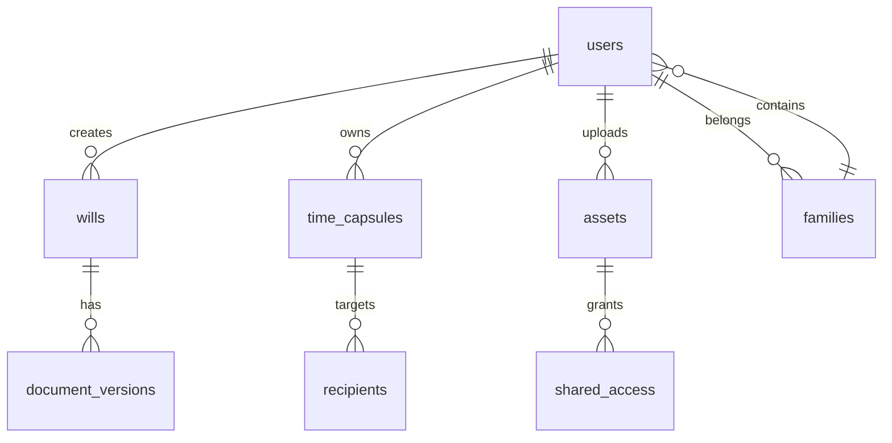

# Phoenix Digital Legacy Platform - Complete Implementation Plan

## Executive Summary

The Phoenix platform is a sophisticated digital legacy planning application built with React/TypeScript. After comprehensive analysis, the codebase shows a complete architectural foundation but requires implementation of core business logic, API endpoints, and integrations to achieve full functionality.

**Current Status**: Architecture complete, implementation needed  
**Timeline**: 10 weeks across 4 phases  
**Scope**: 50+ API endpoints, 15+ database tables, 32+ language support

## Architecture Analysis

### ✅ Completed Components
- **Frontend**: Complete React/TypeScript architecture with Vite
- **UI Library**: Comprehensive component system with shadcn/ui
- **Routing**: React Router with protected routes
- **State Management**: Zustand stores for global state
- **Styling**: Tailwind CSS with custom design tokens
- **PWA**: Service worker and offline capabilities
- **Testing**: Jest and React Testing Framework setup
- **Build System**: Optimized production builds with code splitting

### ❌ Missing Critical Components
- Database schema and migrations
- API endpoints and backend services
- Authentication flow implementation
- Payment processing integration
- File storage and upload system
- Email notification service
- AI integration services
- Security implementation
- Internationalization setup

## Detailed Implementation Plan

### Phase 1: Foundation & Infrastructure (Weeks 1-2)

#### Database Setup
```sql
-- Core tables needed
- users (Clerk integration)
- wills (legal documents)
- time_capsules (scheduled content)
- assets (file storage)
- families (relationship management)
- subscriptions (billing)
- notifications (email/sms)
- audit_logs (compliance)
- encryption_keys (security)
- jurisdictions (legal templates)
- templates (will formats)
- beneficiaries (inheritance)
- emergency_contacts
- shared_access
- document_versions
```

#### Authentication & Security
- **Clerk Integration**: User management, MFA, social logins
- **JWT Implementation**: Token management and refresh
- **RBAC System**: Role-based permissions (user, admin, family)
- **Encryption**: AES-256 for sensitive data
- **Security Headers**: CSP, HSTS, X-Frame-Options

#### API Infrastructure
- **Backend**: Express.js with TypeScript
- **Database**: Supabase (PostgreSQL)
- **Caching**: Redis for session management
- **Rate Limiting**: Express-rate-limit
- **Validation**: Zod schemas for all endpoints

### Phase 2: Core Features (Weeks 3-5)

#### Will Generation System
- **Template Engine**: 10+ jurisdiction-specific templates
- **Form Builder**: Dynamic forms based on legal requirements
- **PDF Generation**: Puppeteer/Playwright for PDF creation
- **E-Signature**: DocuSign/Adobe Sign integration
- **Legal Validation**: Real-time compliance checking
- **Notarization**: Online notary service integration

#### Time Capsule Feature
- **Media Upload**: Photos, videos, audio files (up to 10GB)
- **Scheduling**: Cron jobs for automated release
- **Encryption**: Client-side encryption before upload
- **Recipients**: Email/SMS delivery system
- **Tracking**: Delivery confirmation and read receipts

#### Assets Vault
- **Storage**: AWS S3 with CloudFront CDN
- **File Types**: Documents, images, videos, audio, crypto keys
- **Organization**: Tagging and categorization system
- **Access Control**: Granular permissions for family members
- **Inheritance**: Automated transfer workflows

### Phase 3: Advanced Features (Weeks 6-8)

#### AI Integration
- **OpenAI GPT-4**: Document analysis and suggestions
- **Computer Vision**: Asset categorization and tagging
- **NLP**: Legal document parsing and validation
- **Smart Reminders**: ML-based notification timing
- **Chatbot**: AI assistant for legal guidance

#### Payment System
- **Stripe Integration**: Subscription management
- **Pricing Tiers**: Free, Premium, Family plans
- **Billing**: Automated invoicing and receipts
- **Webhooks**: Real-time subscription updates
- **Tax Handling**: VAT/GST calculations

#### Family Hub
- **Invitation System**: Email/SMS family invites
- **Shared Calendar**: Important dates and reminders
- **Family Tree**: Interactive visualization
- **Collaboration**: Shared planning features
- **Emergency Access**: Break-glass procedures

### Phase 4: Polish & Launch (Weeks 9-10)

#### Internationalization
- **Languages**: 32+ supported languages
- **RTL Support**: Arabic, Hebrew layouts
- **Localization**: Currency, date formats
- **Legal Templates**: Jurisdiction-specific content
- **Translation Management**: Crowdin integration

#### Testing & QA
- **Unit Tests**: 80%+ code coverage
- **Integration Tests**: All API endpoints
- **E2E Tests**: Cypress test suite
- **Security Testing**: OWASP compliance
- **Performance**: Load testing with k6

#### Deployment & Monitoring
- **CI/CD**: GitHub Actions pipeline
- **Infrastructure**: Docker containers on AWS
- **Monitoring**: Sentry for error tracking
- **Analytics**: PostHog for user insights
- **Backups**: Automated daily snapshots

## Technical Specifications

### Database Schema


### API Structure
```
/api/v1/
├── auth/
│   ├── login
│   ├── logout
│   ├── refresh
│   └── verify
├── users/
│   ├── profile
│   ├── settings
│   └── subscription
├── wills/
│   ├── create
│   ├── update
│   ├── generate-pdf
│   └── sign
├── time-capsules/
│   ├── create
│   ├── schedule
│   ├── upload-media
│   └── release
├── assets/
│   ├── upload
│   ├── categorize
│   ├── share
│   └── download
└── families/
    ├── create
    ├── invite
    ├── manage
    └── emergency-access
```

### Security Architecture
- **Zero-Knowledge**: User data encrypted client-side
- **End-to-End**: All communications encrypted
- **Compliance**: GDPR, CCPA, SOC 2 Type II
- **Audit Trail**: All actions logged
- **Access Control**: Principle of least privilege

## Environment Configuration

### Required Environment Variables
```bash
# Database
SUPABASE_URL=
SUPABASE_ANON_KEY=
SUPABASE_SERVICE_KEY=

# Authentication
CLERK_PUBLISHABLE_KEY=
CLERK_SECRET_KEY=
CLERK_WEBHOOK_SECRET=

# Storage
AWS_ACCESS_KEY_ID=
AWS_SECRET_ACCESS_KEY=
AWS_REGION=
S3_BUCKET_NAME=

# Payments
STRIPE_PUBLISHABLE_KEY=
STRIPE_SECRET_KEY=
STRIPE_WEBHOOK_SECRET=

# AI Services
OPENAI_API_KEY=
CLAUDE_API_KEY=

# Email
RESEND_API_KEY=
SENDGRID_API_KEY=

# Monitoring
SENTRY_DSN=
POSTHOG_API_KEY=

# Security
ENCRYPTION_KEY=
JWT_SECRET=
```

## Development Setup

### Prerequisites
- Node.js 18+
- PostgreSQL 14+
- Redis 6+
- AWS CLI configured
- Supabase CLI

### Installation Steps
```bash
# 1. Clone repository
git clone https://github.com/phoenix/legacy-platform.git
cd phoenix

# 2. Install dependencies
npm install

# 3. Set up environment variables
cp .env.example .env.local

# 4. Database setup
supabase start
supabase db reset

# 5. Run development server
npm run dev
```

## Testing Strategy

### Test Coverage Requirements
- **Unit Tests**: 80% minimum coverage
- **Integration Tests**: All API endpoints
- **E2E Tests**: Critical user journeys
- **Security Tests**: OWASP Top 10
- **Performance Tests**: 1000 concurrent users

### Testing Commands
```bash
# Unit tests
npm run test

# Integration tests
npm run test:integration

# E2E tests
npm run test:e2e

# Security tests
npm run test:security

# Performance tests
npm run test:load
```

## Deployment Checklist

### Pre-Launch Requirements
- [ ] Security audit completed
- [ ] Performance benchmarks met
- [ ] Legal compliance verified
- [ ] Accessibility testing passed
- [ ] Browser compatibility tested
- [ ] Mobile responsiveness verified
- [ ] SEO optimization complete
- [ ] Analytics tracking implemented
- [ ] Error monitoring configured
- [ ] Backup procedures tested

### Production Deployment
```bash
# 1. Build production assets
npm run build

# 2. Run migrations
supabase db push

# 3. Deploy to AWS
aws s3 sync dist/ s3://phoenix-legacy-platform

# 4. Invalidate CDN
aws cloudfront create-invalidation --distribution-id EDFDVBD6EXAMPLE --paths "/*"

# 5. Verify deployment
curl https://phoenixlegacy.com/health
```

## Risk Assessment

### High Priority Risks
1. **Legal Compliance**: Ensure all jurisdictions covered
2. **Data Security**: Zero-knowledge architecture implementation
3. **Scalability**: Handle 100k+ concurrent users
4. **Reliability**: 99.9% uptime SLA
5. **Privacy**: GDPR/CCPA compliance

### Mitigation Strategies
- Regular security audits
- Automated backup systems
- Load testing before launch
- Incident response procedures
- Legal review of all templates

## Success Metrics

### Key Performance Indicators
- **User Acquisition**: 10,000 users in first 3 months
- **Conversion Rate**: 15% free to paid
- **Retention**: 80% monthly active users
- **Performance**: <2s page load time
- **Reliability**: 99.9% uptime
- **Security**: Zero data breaches

### Monitoring Dashboard
- Real-time user analytics
- Revenue tracking
- Performance metrics
- Security alerts
- Customer support tickets

## Next Steps

1. **Review and approve** this implementation plan
2. **Set up development environment** with all prerequisites
3. **Begin Phase 1** with database schema and authentication
4. **Schedule weekly check-ins** for progress updates
5. **Plan user testing** sessions for each phase

---

**Document Version**: 1.0  
**Last Updated**: August 2, 2025  
**Author**: Phoenix Architecture Team  
**Review Status**: Ready for implementation