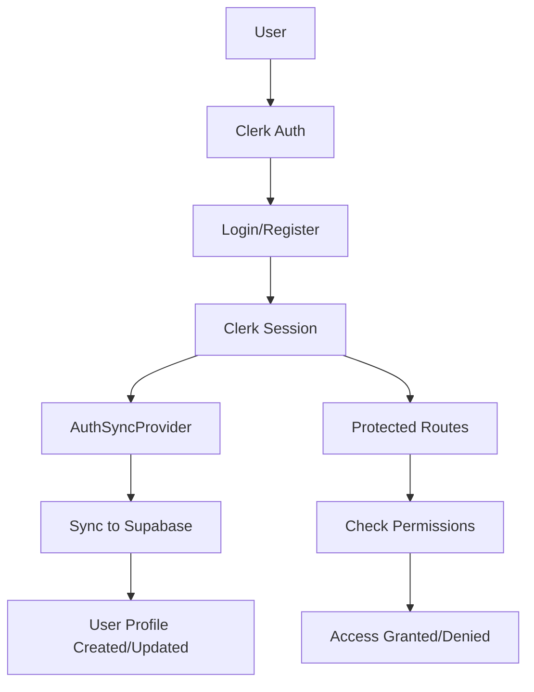

# Authentication and Authorization Setup

## Overview

LegacyGuard uses Clerk for authentication and Supabase for data storage. This document explains how the authentication system is implemented and how to configure it.

## Architecture

### 1. **Clerk Authentication**
- Handles user registration, login, and session management
- Provides social logins (Google, Apple, Microsoft)
- Manages MFA and security features

### 2. **Supabase Integration**
- Stores user profiles and application data
- Syncs with Clerk user data via webhooks
- Handles role-based access control (RBAC)

### 3. **Authentication Flow**



## Implementation Components

### 1. **AuthService** (`/src/services/authService.ts`)
- Syncs Clerk users with Supabase profiles
- Manages user permissions and roles
- Provides permission checking utilities

### 2. **AuthSyncProvider** (`/src/components/auth/AuthSyncProvider.tsx`)
- Automatically syncs authenticated users with Supabase
- Runs on every login to ensure data consistency

### 3. **ProtectedRoute** (`/src/components/auth/ProtectedRoute.tsx`)
- Wraps routes that require authentication
- Supports role-based access control
- Shows loading states and access denied messages

## User Roles and Permissions

### Roles:
1. **user** - Basic user with free tier access
2. **premium** - Premium subscribers with enhanced features
3. **admin** - Administrative users with full access

### Permissions Matrix:

| Permission | User | Premium | Admin |
|------------|------|---------|-------|
| View own profile | ✓ | ✓ | ✓ |
| Edit own profile | ✓ | ✓ | ✓ |
| Create will | ✓ | ✓ | ✓ |
| Unlimited wills | ✗ | ✓ | ✓ |
| Advanced encryption | ✗ | ✓ | ✓ |
| View all users | ✗ | ✗ | ✓ |
| Access admin panel | ✗ | ✗ | ✓ |

## Setup Instructions

### 1. **Configure Clerk**

1. Create a Clerk application at [clerk.com](https://clerk.com)
2. Enable desired authentication methods
3. Add your environment variables:
   ```env
   VITE_CLERK_PUBLISHABLE_KEY=pk_test_...
   CLERK_SECRET_KEY=sk_test_...
   CLERK_WEBHOOK_SECRET=whsec_...
   ```

### 2. **Set Up Clerk Webhook**

1. In Clerk Dashboard, go to Webhooks
2. Create a new endpoint:
   - URL: `https://your-domain.com/api/webhooks/clerk`
   - Events: `user.created`, `user.updated`, `user.deleted`
3. Copy the webhook secret to your environment

### 3. **Configure Supabase**

1. Run the database migrations (already completed)
2. Ensure RLS policies are enabled
3. Add Supabase credentials:
   ```env
   VITE_SUPABASE_URL=https://...supabase.co
   VITE_SUPABASE_ANON_KEY=eyJ...
   SUPABASE_SERVICE_ROLE_KEY=eyJ...
   ```

### 4. **Test the Integration**

1. Sign up a new user
2. Check Supabase to verify user profile was created
3. Try accessing protected routes
4. Test role-based access control

## Usage Examples

### Protecting Routes

```tsx
// Basic authentication required
<Route path="/dashboard" element={
  <SignedIn>
    <Dashboard />
  </SignedIn>
} />

// Admin only route
<Route path="/admin" element={
  <AdminRoute>
    <AdminPanel />
  </AdminRoute>
} />

// Premium feature route
<Route path="/premium-feature" element={
  <ProtectedRoute requiredPermissions={['unlimited_wills']}>
    <PremiumFeature />
  </ProtectedRoute>
} />
```

### Checking Permissions in Components

```tsx
import { usePermissions } from '@/services/authService';

function MyComponent() {
  const { checkPermission } = usePermissions();
  const [canAccessFeature, setCanAccessFeature] = useState(false);

  useEffect(() => {
    checkPermission('advanced_encryption').then(setCanAccessFeature);
  }, []);

  if (!canAccessFeature) {
    return <UpgradePrompt />;
  }

  return <AdvancedFeature />;
}
```

### Syncing Custom User Data

```tsx
import { authService } from '@/services/authService';

// Update user role
await authService.updateUserRole(userId, 'premium');

// Get user permissions
const { role, permissions } = await authService.getUserPermissions(userId);
```

## Security Considerations

1. **Always verify permissions server-side** - Client-side checks are for UX only
2. **Use RLS policies** - Ensure Supabase RLS is properly configured
3. **Validate webhook signatures** - Always verify Clerk webhook authenticity
4. **Secure API routes** - Protect all API endpoints with authentication
5. **Regular audits** - Review user permissions and access logs

## Troubleshooting

### User not syncing to Supabase
1. Check webhook configuration
2. Verify environment variables
3. Check Supabase logs for errors
4. Ensure RLS policies allow insertion

### Permission denied errors
1. Verify user role in Supabase
2. Check permission requirements
3. Ensure AuthSyncProvider is working
4. Review RLS policies

### Webhook failures
1. Check webhook secret
2. Verify endpoint URL
3. Review server logs
4. Test with Clerk webhook testing tool

## Next Steps

1. Configure OAuth providers in Clerk
2. Set up custom user metadata
3. Implement session management
4. Add audit logging
5. Configure MFA requirements
