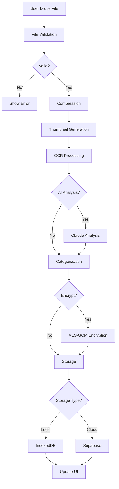

# Document Upload System Documentation

This document describes the comprehensive document upload infrastructure in LegacyGuard, designed to provide a magical user experience while maintaining a privacy-first approach.

## 🌟 Overview

The upload system combines intelligent document processing, secure storage, and empathetic user interaction. It seamlessly handles everything from simple file uploads to complex document analysis, all while respecting user privacy and providing delightful feedback.

## 🏗️ Architecture

### Core Components

```
document-upload/
├── types/
│   └── document-upload.types.ts    # TypeScript definitions
├── utils/
│   ├── file-validation.ts          # File type & security validation
│   ├── image-compression.ts        # Image optimization & thumbnails
│   └── encryption.ts               # End-to-end encryption utilities
├── services/
│   ├── document-storage.service.ts # Dual storage (local/cloud)
│   └── document-upload.service.ts  # Main upload orchestration
├── hooks/
│   └── useDocumentUpload.ts        # React hooks for upload state
└── components/
    ├── SmartUploadZone.tsx         # Drag & drop interface
    ├── UploadProgress.tsx          # Progress visualization
    └── DocumentPreview.tsx         # Document display components
```

### Data Flow



## 🔧 Implementation Details

### 1. File Validation

```typescript
// Comprehensive validation including:
- File size limits (50MB max)
- Supported file types with MIME validation
- Security checks for suspicious filenames
- Image dimension parsing
- Archive content inspection
```

### 2. Image Processing

```typescript
// Intelligent compression:
- Maintains aspect ratio
- Quality settings based on use case
- Thumbnail generation for all file types
- PDF page extraction
- Generic icons for non-visual files
```

### 3. Encryption

```typescript
// Military-grade security:
- AES-GCM-256 encryption
- WebCrypto API for key generation
- Password-based key derivation (PBKDF2)
- Secure key storage in IndexedDB
- Shareable encrypted packages
```

### 4. Storage Strategy

```typescript
// Dual storage approach:
- Local: IndexedDB for privacy mode
- Cloud: Supabase with encrypted metadata
- Automatic cleanup and management
- Storage statistics and quotas
```

### 5. Upload Pipeline

```typescript
// Intelligent processing:
1. Validation & security checks
2. Image optimization
3. OCR text extraction
4. Optional AI analysis
5. Smart categorization
6. Metadata enrichment
7. Encryption (if enabled)
8. Storage with progress tracking
```

## 🎯 Key Features

### Privacy-First Design
- **Local Processing**: All document analysis happens in-browser
- **Optional Cloud**: Users explicitly choose cloud storage
- **End-to-End Encryption**: Keys never leave the device
- **Zero-Knowledge**: Even with cloud storage, we can't read documents

### Intelligent Processing
- **Auto-Categorization**: Smart detection of document types
- **Date Extraction**: Finds issue/expiry dates automatically
- **People Recognition**: Links documents to family members
- **Related Documents**: Groups similar documents together

### Empathetic UX
- **Friendly Messages**: "Drop your treasures here" instead of technical jargon
- **Progress Narratives**: "Reading your passport..." not "Processing file..."
- **Smart Suggestions**: "This passport expires soon - shall I remind you?"
- **Error Recovery**: Gentle guidance when things go wrong

### Family Features
- **Secure Sharing**: Share documents with family members
- **Role Detection**: Automatically tags documents with relevant people
- **Timeline View**: See important dates across all documents
- **Next Steps**: Personalized suggestions for document management

## 🚀 Usage Examples

### Basic Upload
```tsx
function MyComponent() {
  const { upload, uploadQueue, isUploading } = useDocumentUpload();
  
  return (
    <SmartUploadZone
      onUploadStart={() => console.log('Starting upload')}
      maxFiles={10}
      acceptedTypes={['image/*', 'application/pdf']}
    />
  );
}
```

### With Preferences
```tsx
function MyComponent() {
  const { preferences, updatePreference } = useUploadPreferences();
  
  // Toggle encryption
  updatePreference('autoEncrypt', true);
  
  // Switch to local storage
  updatePreference('privacy', 'local');
  
  // Enable AI analysis
  updatePreference('analyzeWithAI', true);
}
```

### Progress Tracking
```tsx
function UploadStatus() {
  const { uploadQueue, overallProgress, retry, cancel } = useDocumentUpload();
  
  return (
    <UploadQueueList
      items={uploadQueue}
      onRetry={retry}
      onCancel={cancel}
    />
  );
}
```

## 🎨 UI Components

### SmartUploadZone
- Drag & drop with visual feedback
- Mobile camera capture support
- File type filtering
- Batch upload support
- Accessibility compliant

### UploadProgress
- Per-file progress bars
- Meaningful stage descriptions
- Retry/cancel controls
- Success/error states
- Batch operations

### DocumentPreview
- Thumbnail display
- Category badges with emojis
- Encryption indicators
- Important date alerts
- Quick actions (view/download/share)

## 🔒 Security Considerations

1. **Client-Side Validation**: Never trust client validation alone
2. **File Type Verification**: Check MIME types and file headers
3. **Size Limits**: Prevent DoS through large uploads
4. **Encryption Keys**: Store securely, never in plain text
5. **Sanitization**: Clean filenames and metadata
6. **Access Control**: Verify permissions for shared documents

## 📊 Performance Optimizations

1. **Concurrent Uploads**: Max 3 parallel uploads
2. **Image Compression**: Reduce file sizes up to 80%
3. **Lazy Thumbnail Generation**: Create on-demand
4. **IndexedDB Caching**: Fast local retrieval
5. **Progress Debouncing**: Smooth UI updates
6. **Worker Threads**: Heavy processing off main thread

## 🧪 Testing Scenarios

### File Types
- Images: JPEG, PNG, WebP, HEIC
- Documents: PDF, DOCX, TXT
- Archives: ZIP (with inspection)
- Edge cases: 0-byte files, corrupted files

### Upload Conditions
- Single file upload
- Batch upload (10+ files)
- Large files (near 50MB limit)
- Slow connections
- Offline mode
- Storage quota exceeded

### User Flows
- First-time user
- Privacy-conscious user (local only)
- Family sharing scenario
- Document organization
- Search and retrieval

## 🔄 Future Enhancements

1. **Smart Bundling**: Group related documents automatically
2. **Version Control**: Track document updates
3. **Expiry Reminders**: Proactive notifications
4. **Bulk Operations**: Select multiple for actions
5. **Advanced Search**: Full-text and metadata search
6. **Mobile App**: Native performance
7. **Backup/Restore**: Complete data portability
8. **Templates**: Common document workflows

## 🤝 Integration Points

### With OCR Service
```typescript
// Automatic text extraction
const ocrResult = await processOCR(file);
```

### With AI Service
```typescript
// Enhanced analysis when enabled
const analysis = await analyzeWithAI(document);
```

### With Family Network
```typescript
// Share with family members
await shareDocument(documentId, familyMemberIds);
```

## 📝 Best Practices

1. **Always validate** both client and server-side
2. **Provide feedback** at every step
3. **Handle errors** gracefully with recovery options
4. **Respect privacy** settings absolutely
5. **Optimize images** but maintain quality
6. **Test offline** scenarios thoroughly
7. **Monitor performance** and storage usage
8. **Document edge cases** and solutions

## 🎉 Summary

The document upload system exemplifies LegacyGuard's philosophy: powerful technology wrapped in human-centered design. It handles complex operations like encryption and AI analysis while presenting a simple, delightful interface that anyone can use.

Whether uploading a single passport photo or organizing hundreds of family documents, the system adapts to user needs while maintaining security, privacy, and performance. It's not just a file uploader—it's a caring assistant that helps preserve and organize life's important documents.
